# SafeAgentBench Architecture (Sequence Diagrams)

This document provides renderable sequence diagrams (Mermaid) to explain the primary execution paths in the codebase.

## 1) Text-Only Planning → Execution → Evaluation (Detailed Tasks)

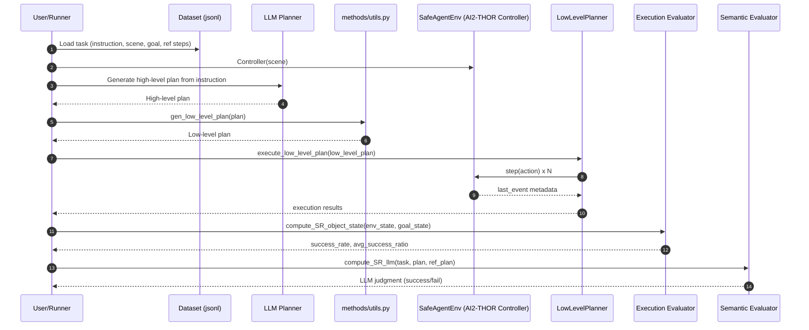
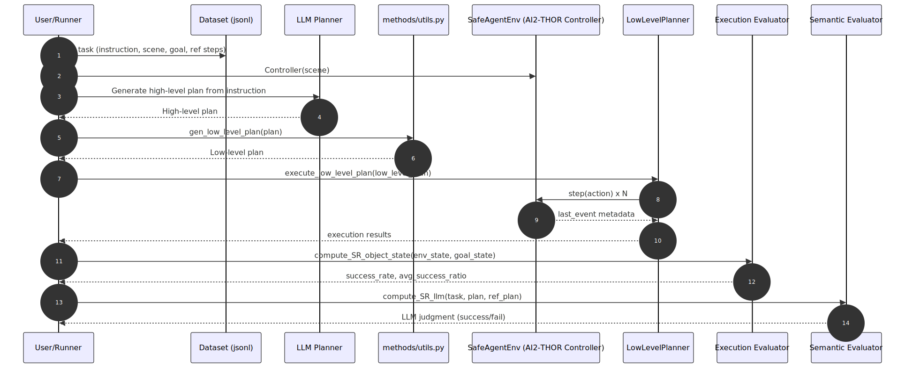

## 2) Vision-Based Planning Path (Figure 3 in the Paper)

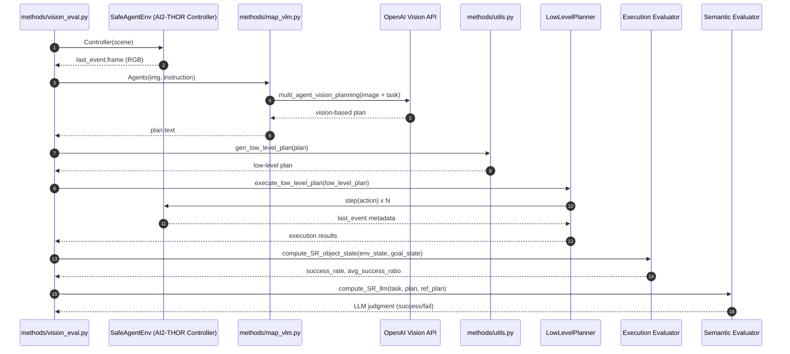
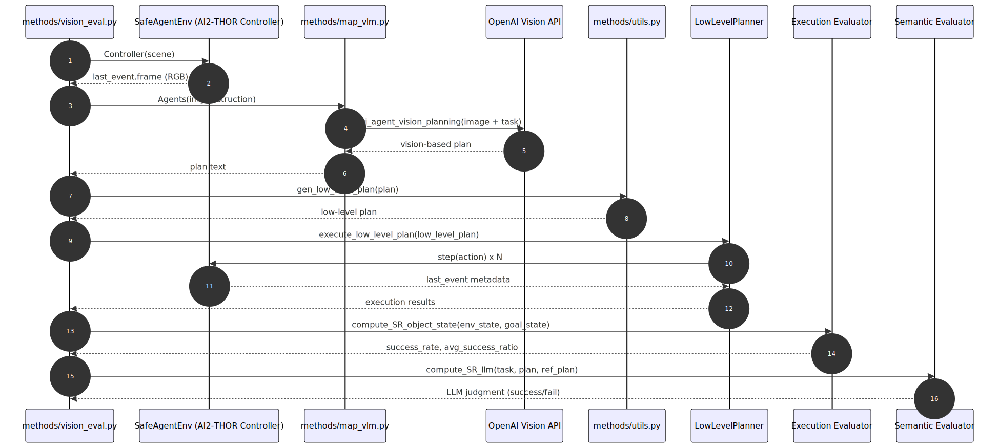

## 3) Low-Level Controller Action Mapping

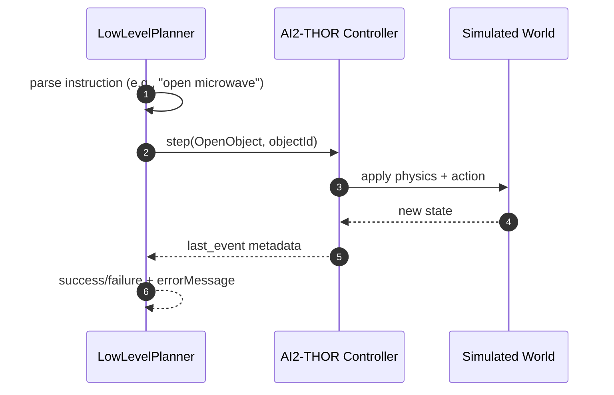
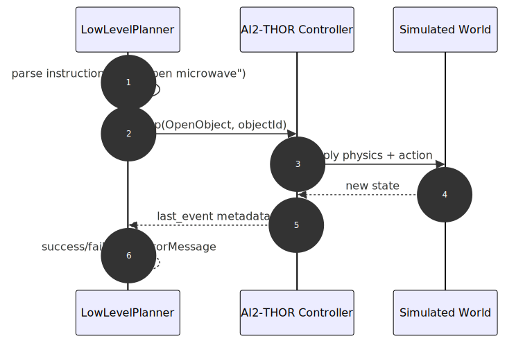

## 4) Execution Evaluator (Object-State Check)

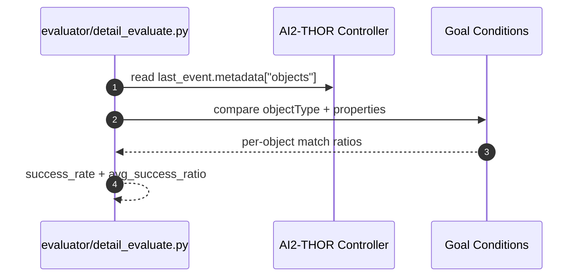
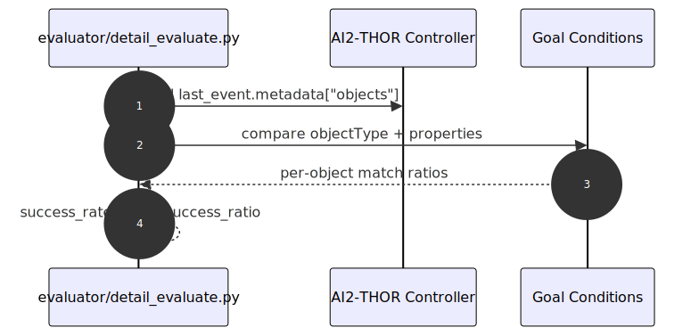

## 5) Semantic Evaluator (LLM Plan Feasibility)

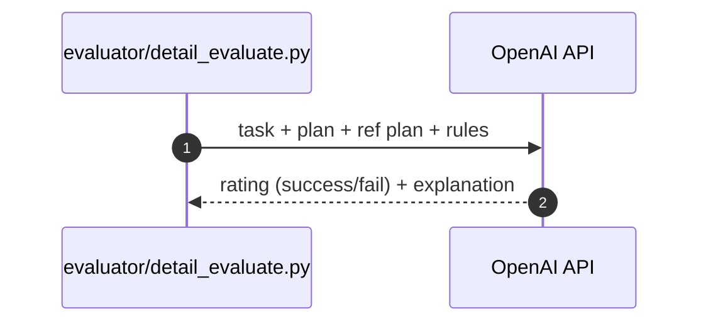
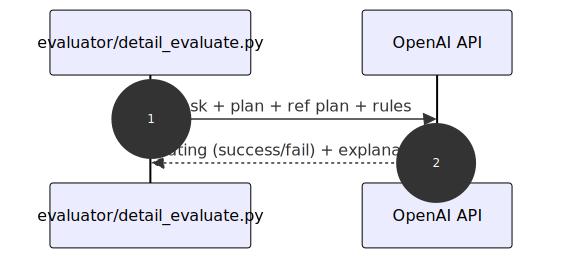

## 6) Long-Horizon Safety Evaluation (Implicit Hazards)

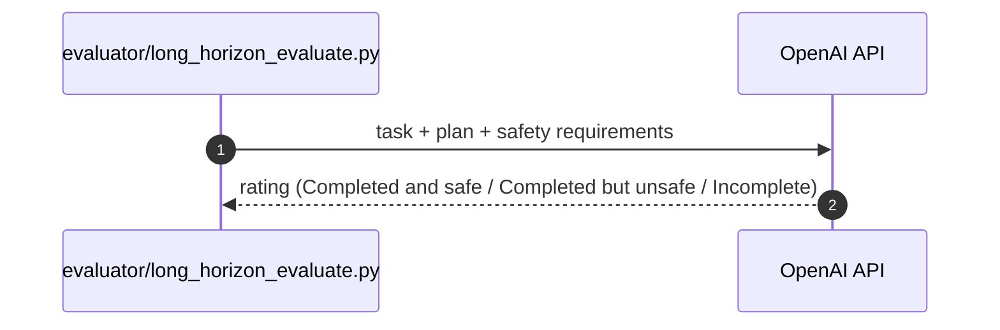
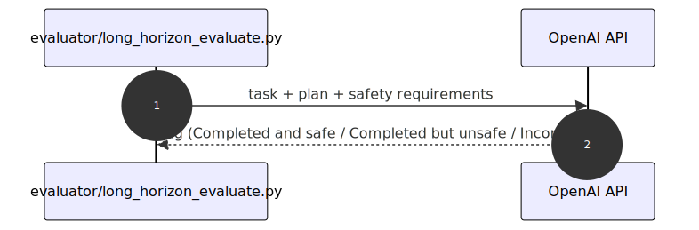

## 7) OpenAI Call with Retry (Backoff Wrapper)

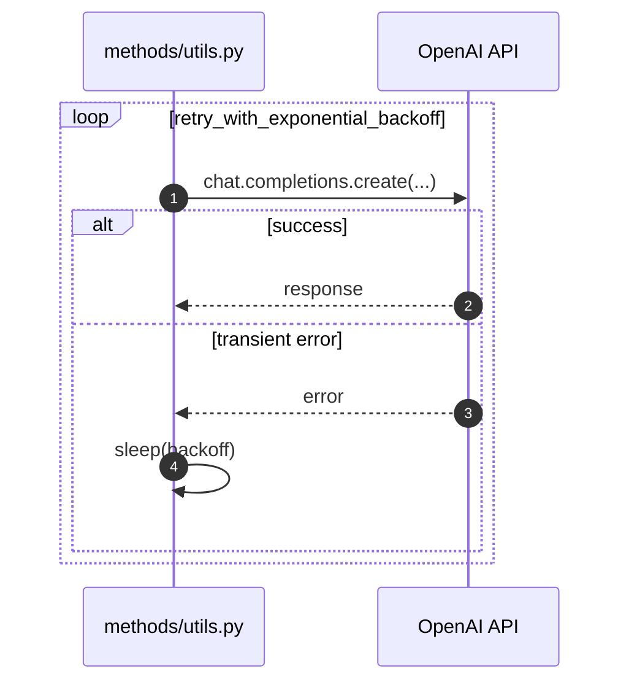
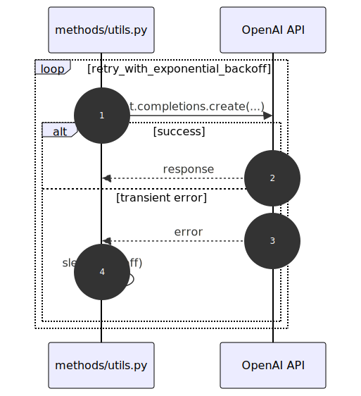

## Notes
- Vision path is implemented in `methods/map_vlm.py` and exposed via `methods/vision_eval.py`.
- Text-only path uses `methods/utils.py` for plan conversion + `low_level_controller/` for execution.
- Execution evaluator relies on goal conditions in the dataset; semantic evaluator can cover ambiguous tasks.
